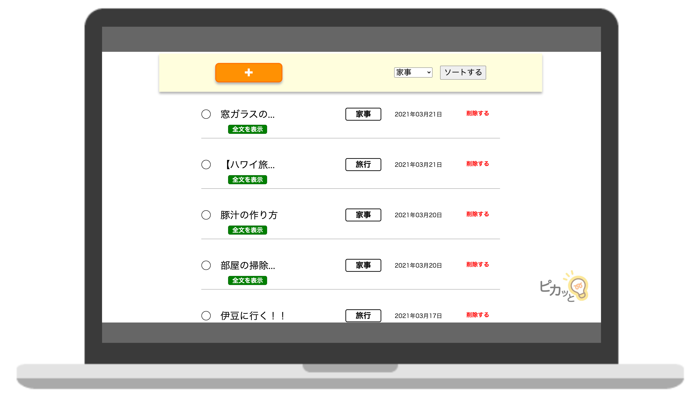
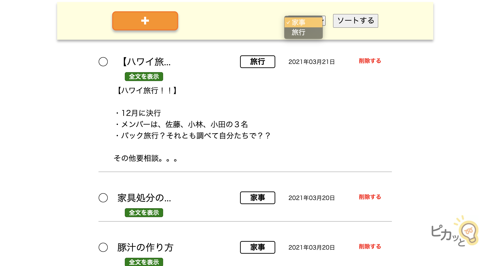
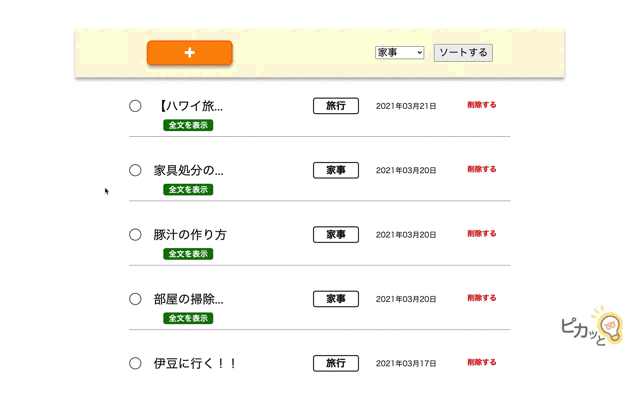
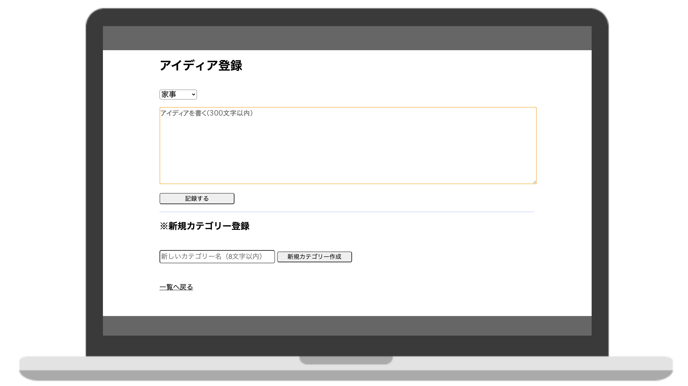
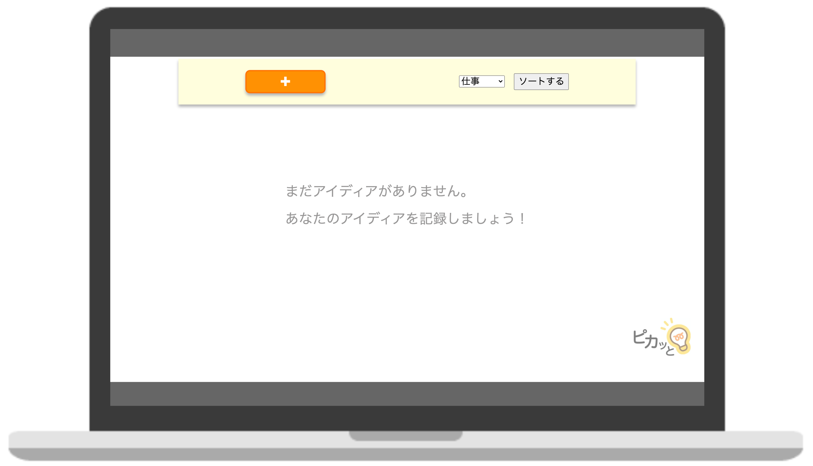
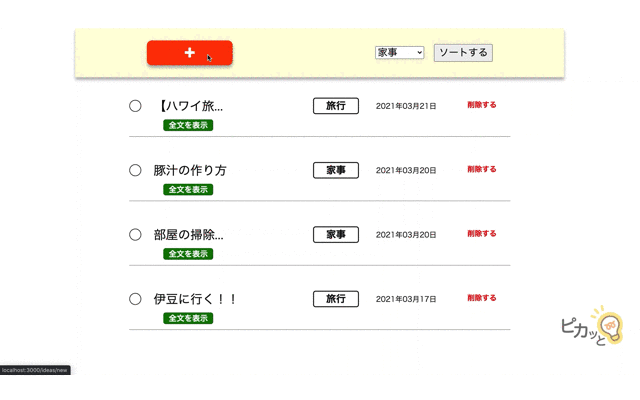

# 課題説明
  
## 開発したAPI名
「ピカッと」

## テーマは？
アイディアの記録APIです。  
「ピカッと」のコンセプトは、「一瞬のヒラメキを残す」です。

## 機能
① アイディア記録機能  
② アイディア詳細閲覧機能  
③ アイディア削除機能     
④ カテゴリー新規登録機能  
（↑実装済み）   
⑤ カテゴリーによるソート機能  
（↑未実装）  

## 課題未達成部分
- カテゴリー登録機能の一意性制約
- カテゴリー別のソート機能
- テストコードの記述（**モデルのみ記述済み**）
- エラーレスポンス確認

## 不具合（改修予定）
- 全文表示展開が「先頭のアイディア」のみ可能。

## 開発環境  
- Ruby 2.6.5
- Ruby on Rails 6.0.3.4
- HTML
- CSS
- JavaScript
- MySQL 5.6  
- macOS Catalina 10.15.7
- Visual Studio Code
- Github  

## Cloneの作成

```
% git clone https://github.com/yoheioda0127/idea_app.git
```

## テーブル設計
### Ideasテーブル
| Column             | Type    | Options     |
| --------------     | ------- | ----------- |
| body               | text    | null: false |
| category_id        | integer | null: false |

#### Association
- belongs_to :category

### Categoriesテーブル
| Column        | Type    | Options                   |
| ------------  | ------- | ------------------------- |
| name          | string  | null: false, unique: true |

#### Association
- has_many :ideas

## 初期動作時の勧め

稼働前に以下のコードをターミナルにて実行ください。  
実行すると、サンプルでカテゴリーを追加登録できます。  

```
rails db:seed
```

## 機能説明
※以下、ローカルでの稼働状況。

### トップページ（アイディア一覧機能）
トップページには、全てのアイディアを、昇順で表示しています（画像1）。  
本ページにて、「アイディア詳細閲覧」、「アイディアの削除」、「カテゴリー別のソート（未実装）」を行うことができます（画像2、gif画像1）。  
画面左上のオレンジの「＋」ボタンは、新規アイディア登録ページへのリンクです。  
  
↑画像1. トップ画面  
  
↑画像2. アイディア詳細展開時  
  
↑gif画像1. 機能デモ（その1）

### アイディア登録画面＋新規カテゴリー追加画面
アイディア登録画面と新規カテゴリー追加画面では、文字通り、アイディア登録と新規カテゴリー追加を行うことができます（gif画像2、画像3）。  
画面上半分がアイディア。  
下半分がカテゴリーです。  
また、投稿がないときは、一覧ページに投稿を促すメッセージが出力されます（画像４）。   

  
↑画像3.アイディア登録画面＋新規カテゴリー追加画面 
  
↑画像4. トップ画面（投稿無し） 
  
↑gif画像2. 機能デモ（その2）アイディア登録  

## 工夫点
- UIのメリハリをつけました。
- 組み込み式のAPIということも想定して、全体をシンプルな見た目にしました。
- アプリアイコンの主張は控え目にしています。
- アイディアがなにもないときにも、投稿を促すテキストを表示しています。
- アイディア詳細閲覧機能は、改行などを反映して表示しています。


